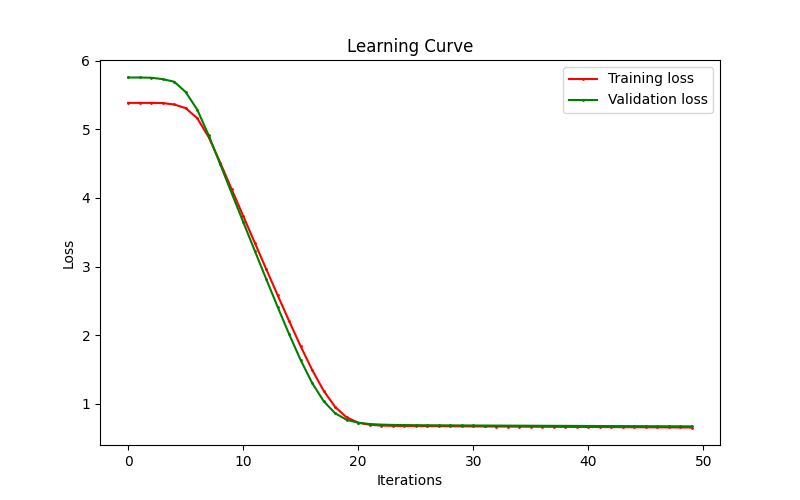
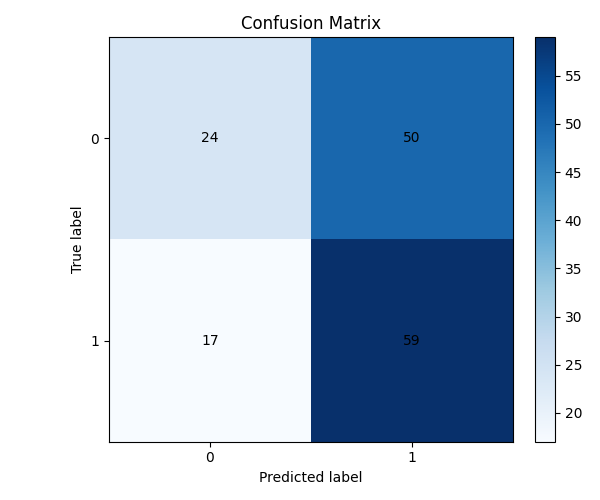
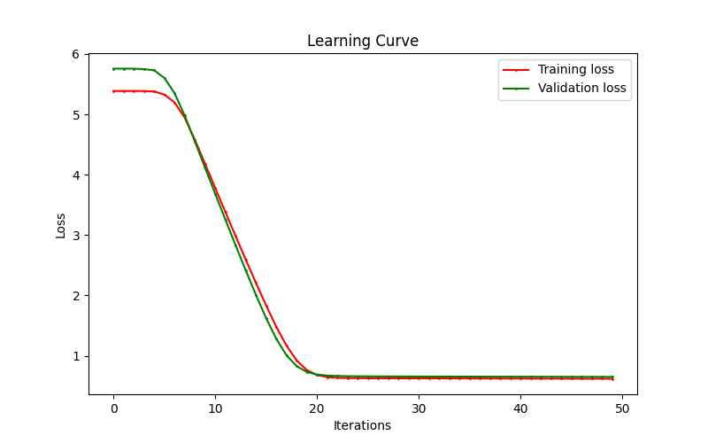
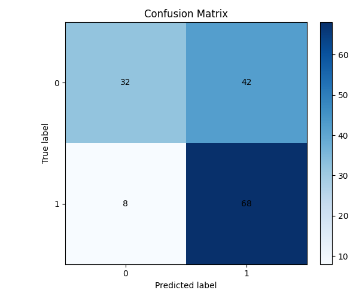

# Assignment 2 Report

## --- Evaluating Top Two Models on Unseen Testing Data ---

### Evaluating Rank 1 Model [LR: 0.1, Lambda: 4.0]:
- **Training loss (Epoch 50):** 0.7131110795455282
- **Validation loss (Epoch 50):** 0.747272516443674

#### 1a Learning Curve (LR: 0.1, Lambda: 4.0)

#### 1a Confusion Matrix (LR: 0.1, Lambda: 4.0)

---

### Evaluating Rank 2 Model [LR: 0.1, Lambda: 8.0]:
- **1b Learning Curve (LR: 0.1, Lambda: 8.0)**

#### 1b Confusion Matrix (LR: 0.1, Lambda: 8.0)

